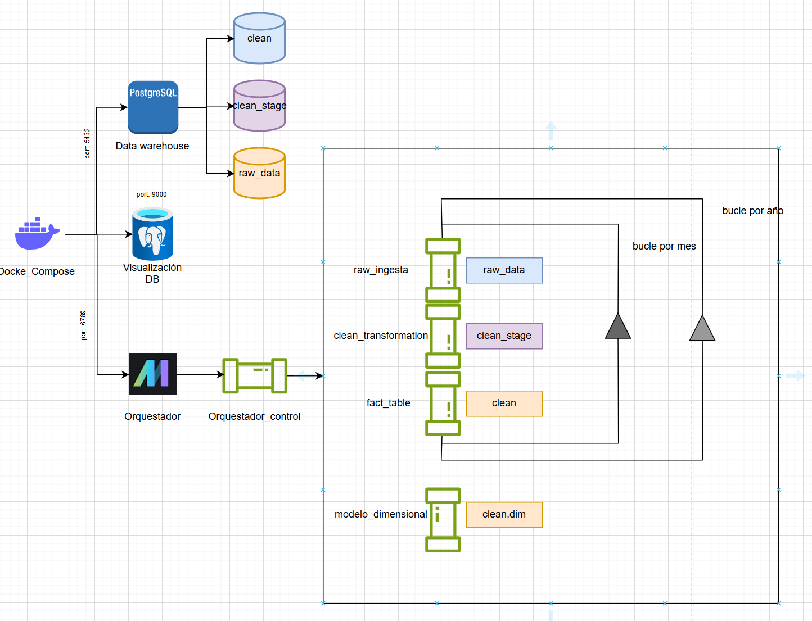
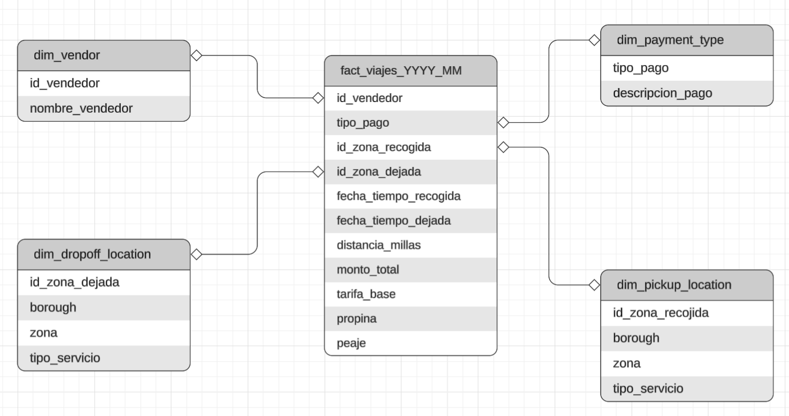

# Proyecto PSet 2
## Objetivo
Diseñar una arquitectura ELT reproducible y orquestada, completamente desplegada con Docker Compose, utilizando Mage como orquestador, PostgreSQL como data warehouse y pgAdmin como herramienta de inspección y validación.

## Estructura del proyecto
El trabajo tiene dos partes importantes:
    1. Ingesta de datos crudos de registro de viajes TLC de taxis amarillo de Nueva York en formato parquet. Se requiere descargar de manera automatica los datos por cada mes de cada año.
    2. Limpieza de los datos (registros inconsistentes, vacio o inválidos), los cuales luego deberan ser almacenados utilizando modelamiento dimensional.

### Ingesta de datos
Flujo :          
				Lectura de archivo parquet desde pagina web

                                    |
									
        Estandarizacion de nombres de columnas para tabla(Postgresql)
		
                                    |
									
       Almacenar datos en schema raw_data - tabla taxi_amarillo_YYYY_MM
	   

- Se crea el pipeline parametrizado **raw_ingestion**, el cual consta de un bloque Extract_raw, utilizado para leer el archivo y guardar en memoria. Transform_raw, realiza una estadarizacion de nombre de columnas (minusculas, snake). Raw_to_db, guarda los datos en chunks para evitar que el kernel se detenga. (*Lo que paso con cualquier año, ha excepcion del 2025, con el cual se puedo descargar todo el año sin problemas, pero en el caso del año 2018 por ejemplo el kernel se detenia en esta estapa e incluso en la etapa Transform*)

- Para ejecutar el pipeline en un bucle, en el cual se descargaron, transformaron y guardaron en tablas de DB, los datos de todos los meses del 2025. Se utilizo un pipeline **raw_controler**, el cual ejecutaba esta secuencia por cada mes, para que sea secuencia y no paralela se utilizaba un delay, el cual luego de cierto tiempo volvia  ejecutar el pipeline **raw_ingestion**, con otro mes.

- En el pipeline **raw_ingestion** se introducen las variables={'year': year,'month': month}, que pueden ser listas de años y meses respectivamente.

### Limpieza de datos
Flujo :  
		Limpieza de datos (registros inconsistentes, vacio o inválidos)
		
                                    |
									
            Se almacena en schema clean_stage en tablas por mes del año
			
                                    |
									
                Se construyeron las dimensiones de los datos
				
                                    |
									
                Se construye tabla de hechos por meses del año

Para realizar la limpieza, se requirio realizar un analisis previo, **notebook: EDA.ipynb**, en el cual se analizan las 20 columnas del dataset. (Las variables se analizaron con el nombre original pues se tomo de referencia el documento *Yellow Trips Data Dictionary**, del sitio web https://www.nyc.gov/site/tlc/about/tlc-trip-record-data.page), despues de analisis, se utilizan los siguientes criterios para la limpieza. La cual se realizo en **SQL**, ya que en python la carga de los datos, agotaba la ram incluso realizando chunking.

    - VendorID: No tiene inconvenientes
	
    - tpep_pickup_datetime: No tiene inconvenientes 
	
    - tpep_dropoff_datetime: No tiene inconvenientes
	
    - passenger_count: Tiene valores de 0 al 9, además de un porcentaje de nulos
	
	    Cero: 
            -Viaje cancelado: distancia del viaje = 0 ó valor de tarifa = 0, tiene mucha discrepacia, entonces se toma como viaje cancelado que PULocationID y DOLocationID sean iguales.
            -Puede deberse a viajes que se realizan solo como envío
            -Se revisa tarifa, tipo de pago, y bandera de sistema. No existe un valor que se repita para asumir algo
            -Error del vendedor, tampoco probable ya que no es un solo vendedor el que tiene 0 en sus registros
			
	    Nulos: 
            -No es un solo vendedor
            -Es un solo tipo de pago: 0 - Flex Fare trip, entiendo que esta modalidad es similar al servicio de uber talvez por eso no se cargan la información de pasajeros
            -Eliminar viajes cancelados: distancia del viaje = 0 ó valor de tarifa = 0, tiene mucha discrepacia, entonces se toma como viaje cancelado que PULocationID y DOLocationID sean iguales.
        Reemplazar null con -1: que indica que se desconoce el numero total de pasajeros
		
    - trip_distance: No tiene valores nulos, ni distancias negativas, distancia cero (puede ser cancelación de viaje, se tendría que analizar las ubicaciones)
            -Existen distancias exageradas de varias millas, se realiza un análisis a distancias mayores a 302 millas, que de acuerdo a Google es la extensión total de NY.
            -Eliminar elementos con total base 0 o que las ubicaciones sean iguales.
			
    - RatecodeID: Tiene valores nulos
            -Los pasajeros nulos tienen RatecodeID nulo.
            -Es un solo tipo de pago: 0 - Flex Fare trip, al ser este tipo de viajes, puede ser que no se apegue a las rutas convencionales de un taxi.
            -Eliminar viajes cancelados: distancia del viaje = 0 ó valor de tarifa = 0, tiene mucha discrepacia, entonces se toma como viaje cancelado que PULocationID y DOLocationID sean iguales.
            -Reemplazar null con 99 que significa null
			
    - store_and_fwd_flag:  Posee valores nulos
            -Los nulos, solo tiene igual pasajeros nulos, ratecodeid nulo
            -Es un solo tipo de pago: 0 - Flex Fare trip, al ser este tipo de viajes, al ser este tipo de viajes es posible que no se almacenen y envíen de la misma manera que otros pagos.
    
	- PULocationID y DOLocationID: sin valores nulos, son códigos del 1 al 265, que simbolizan borough de NY.
	
    - payment_type: no hay nulos
	
    - fare_amount: no hay nulos, pero existen valores negativos y en el caso de los positivos uno demasiado alto (6 cifras).
            -Valores negativos: No tomar en cuenta valores donde PULocationID y DOLocationID, son iguales y la distancia recorrida es cero. Deberia corresponder a viajes cancelados. Ademas el VendorID 2, es quien tiene estos valores de seguro una falla en su sistema, a los restantes se los convierte en positivos.
            -Valores positivos: No tomar en cuenta valores donde PULocationID y DOLocationID, son iguales y la distancia recorrida es cero. Deberia corresponder a viajes cancelados.
            -Existen tarifas altas, las cuales se eliminaran si no son RatecodeID: 4 o 5, y si el valor supera los 600 dolares (investigando en internet no es posible generar en NY mas de 500 en un día) y además la distancia menor a 300 millas (es la extension de NY)
    
	- extra: No tiene valores nulos, tiene valores negativos y el máximo es 15
            -No hay patron definido para los valores negativos, mas que los valores del total es negativo, lo cuales deberían ser eliminados o vueltos positivos en la limpieza de fare_amount
    
	- mta_tax: De acuerdo a internet esta tasa de 0.50 ctvs, cualquier otro valor no tiene sentido. Y además esos valores representan un 0.002% en el dataset utilizado para el analisis (2025/01). Por lo incluso seria conveniente eliminarlos.
    
	- tip_amount: no hay nulos, propinas negativas son solo el 0.0035% del total del dataset (2025/01) y son del VendorID=2.
            -Existen propinas por encima de 20% del total, pero en este caso son el 5%, de esta propinas varias son con cash, a pesar de que no se deberían registrar.
            -Eliminar celdas con propinas pagadas en efectivo: payment_type = 2
    
	- tolls_amount: No hay valores nulos, ni valores excesivos, pero si valores negativos, los cuales provienen todos del vendedor 2, los deben manejarse con fare_amount.
   
	- improvement_surcharge: De acuerdo a intenet el valor es de $1 o $0, pero en el dataset hay valores de 0.3 y -1.
            -Valores negativos, se podrían manejar con fare_amount
            -Valores 0.3 representan un porcentaje mínimo que se puede eliminar.
    
	- total_amount: No tiene nulos, pero si valores negativos que representan un 2% del total del dataset (2025/01), e incluso puede ser manejado con fare_amount
    
	- congestion_surcharge: De acuerdo a internet el valor de este impuesto es de $2.5 o $0, se tienen valores negativos que representan un 1% del global.
            -Se tiene valores nulos, pero de igual manera no tienen un numero de pasajeros, ni un ratecodeid, además del payment = 0, es decir es un tipo de servicio Flex Fare trip, el cual de seguro no paga este impuesto, es conveniente reemplazar con 0.
    
	- airport_fee:  De acuerdo a internet, los valores son de $1.75 y $0, existen otros valores que de seguro son errores de tipeo, pero se pueden reemplazar o eliminar si todavía se conservan luegos de los criterios utilizados en columnas previas.
    
	- cbd_congestion_fee: Impuesto de valor $0.75 y $0, solo se tienen valores negativos, que es un mínimo porcentaje que podría eliminarse.

Este proceso lo realiza el pipeline **clean_transformation**, al cual tambien se lo ejecutado un controlador denominado **clean_controler**, en el cual similar al primer controlador se le pueden enviar las variables={'year': year,'month': month}, que pueden ser listas de años y meses respectivamente.

### Modelo Dimensional
Se utiliza otro pipeline para crear las dimensiones **modelo_dimensional**, con las dimensiones solicitadas: 
    - dim_vendor
        1 'Creative Mobile Technologies'
        2  'Curb Mobility'
        6 'Myle Technologies Inc'
        7 'Helix'
        Otro caso 'Desconocido'
    - dim_payment_type
        0 'Flex Fare trip'
        1 'Tarjeta crédito'
        2 'Efectivo'
        3 'Sin cargo'
        4 'Disputa'
        5 'Desconocido'
        6 'Viaje anulado'
        Otro caso 'Otro'
    - dim_pickup_location
    - dim_dropoff_location
        borough, zona, tipo_servicio: estos datos se obtiene del csv *Taxi Zone Lookup Table*, de la pagina web https://www.nyc.gov/site/tlc/about/tlc-trip-record-data.page
Se ejecuto el pipeline, como solo se requiere una vez.

### Tabla de Hechos
Para crear la tabla de hechos se utiliza el pipeline **fact_table**, el cual tambien se ejecuto con controlador (para este caso se utilizo el mismo *clean_controler*, cambiando el pipeline). 
 - Granularidad: 1 fila = 1 viaje
 - Metricas e información: id_vendedor,tipo_pago,id_zona_recogida,id_zona_dejada, fecha_tiempo_recogida,fecha_tiempo_dejada,distancia_millas,monto_total,tarifa_base,propina,peaje.

## Entorno y Funcionamiento del diseño
- Se creo un entorno utilizando docker Compose, para ello se requiere en primera instancia levantar y construirlo para ello se utiliza la terminal en el directorio del archivo *docker-compose.yaml*, se utiliza 'docker compose up --build'.
- El orquestador utilizado es mage ia (port:6789), el cual se puede ingresar con las credenciales
    -Correo: admin@admin.com
    -Contraseña: admin 
  En este orquestador son de relevancia los pipeles:
  1. raw_ingestion: Permite descargar datos de viajes de taxi y guardarlos en tablas DB (*raw_data*).
  2. clean_trasformation: Realiza la limpieza de los datos y los guarda en otra DB (*clean_stage*)
  3. modelo_dimensional: Crea las dimensiones del modelo dimensional en el cual se guardan los datos limpios
  4. fact_tañble: Crea la tabla de hechos.
  5. orquestador_control: Anteriormente se utilizaron otros controladores para ejecutar las operaciones de ingesta y limpieza, pero es requerido un controlador que lo haga todo a la vez,para ellos de igual manera se deben establecer las variables={'year': year,'month': month}, que pueden ser listas de años y meses respectivamente.  Este pipeline sigue el siguiente flujo.

Ejecuta:

  POR CADA MES (incluso se podria por cada año):
  
            raw_ingestion
			
                 |

       clean_transformation

                 |

            fact_table

                 |

    AL FINAL:    |
	
        modelo_dimensional (que crea las dimensiones, una sola vez)

- Para visualizar las tablas se utiliza pgAdmin (port: 9000), para acceder al servicio se utiizan las sigueintes credenciales
  
    -Correo: sanalvarez1999@gmail.com
    -Contraseña:root
    -Contraseña de Conexión a base de datos: root

  Los datos se encuentran en Servers>pset2>warehouse>Schemas
  
    1. clean: datos limpios; dimensiones y tablas de hecho
    2. clean_stage: tablas de datos luego de limpieza antes de modelo dimensional
    3. public: schema vacío
    4. raw_data: datos crudos, obtenidos de pagina web 

### Diagrama arquitectura

### Esquema modelo dimensional

